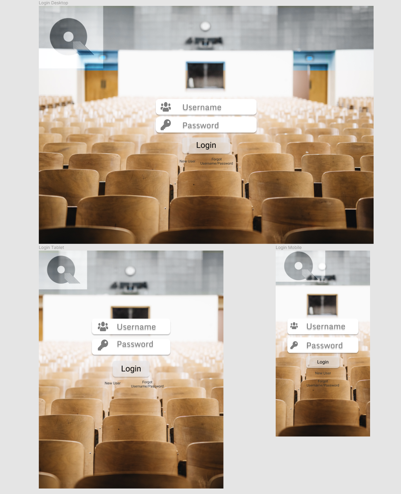
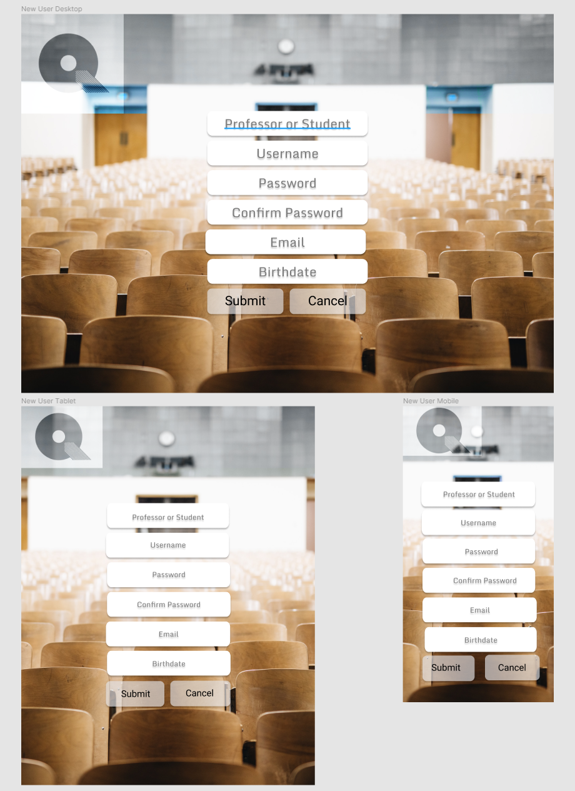
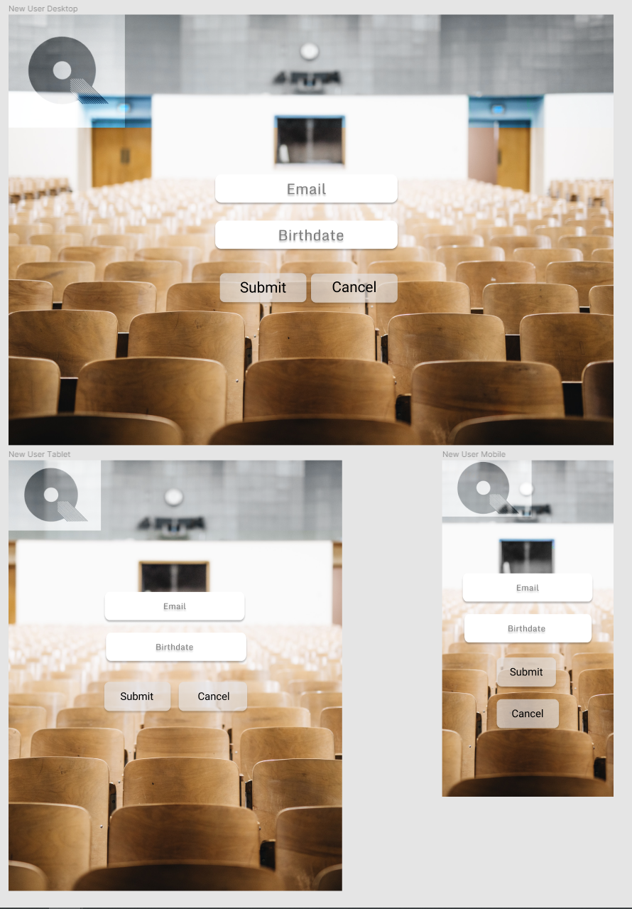
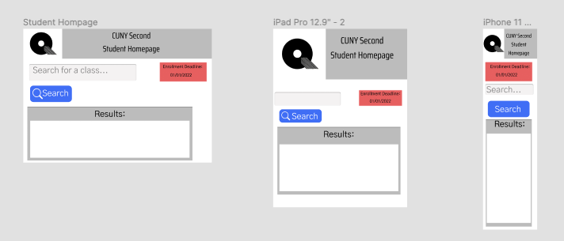
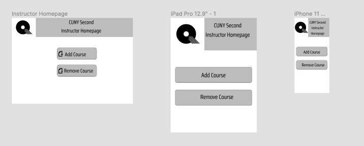
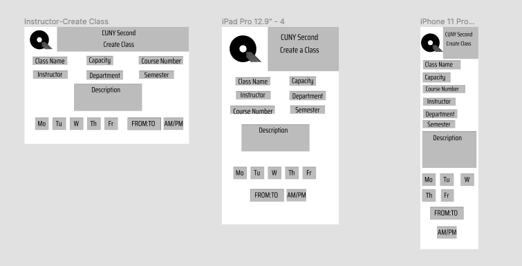
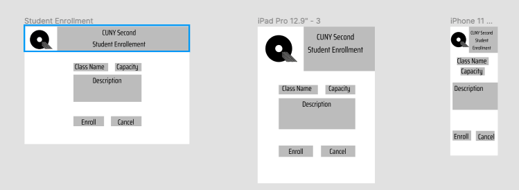

# CunySecond

## Purpose
The purpose of the site is to simnplify how and improve upon how Professors 
and Students plan and make their schedules for classes. Cunyfirst is clunky and
unoptimized. We want to streamline the experience especially when it comes to devices
that are not desktops.

## Resources and Technology used
- Figma
- React.js
- MongoDB
- Node.js

## Visual Designs

### Login Page

### New User Page

### Forgot UserName/Password page

### Student Homepage

### Teacher Homepage

### Teacher - Create a Class

### Student Enrollment 

